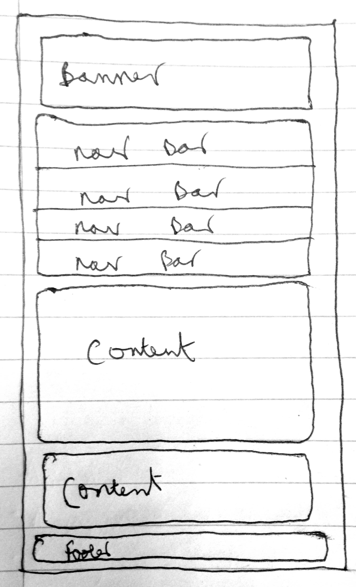
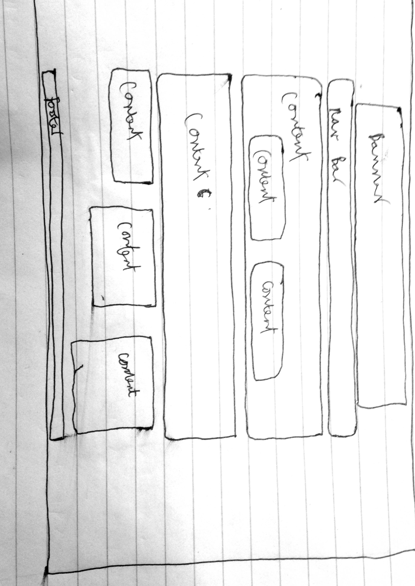
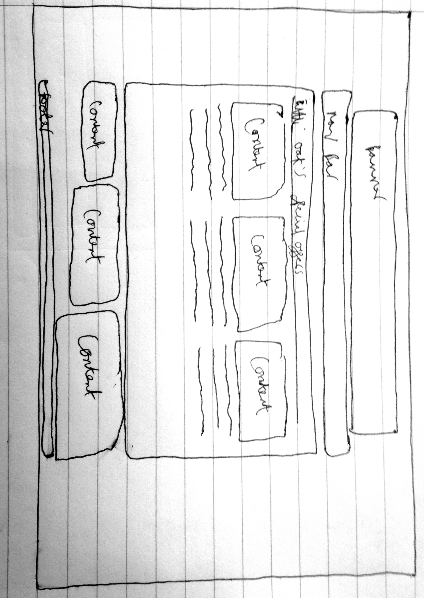
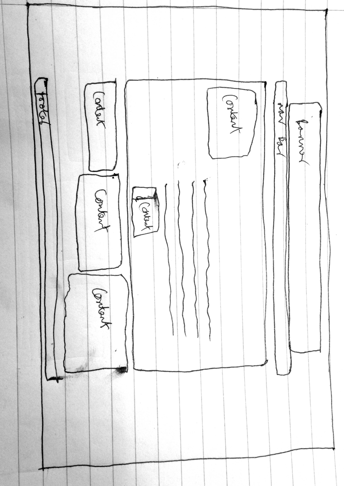

Introduction: 
The website is about a local newsagent in Nottingham that does not have a website displaying their products to their potential customers online. Therefore this website will display information about them, what products they sell, how much they sell them for, the offers they have and information about the products. The pages the website will have are the index, special offers, grocery and alcohol. I did not create a sweet page due to the fact that the layout will be the same as the grocery and special offers page however the images and content on the page would be different but the layout and features would be the same.   

Design:
Before I build the website I thought it would be a good idea to design what the website will look like with the breaking point therefore a design for mobiles and then a design for tablets and laptops. This allowed me to know how to layout the content in the most appealing way on a mobile screen with all the important information clearly at top. This therefore saved me on not having to re code/design the layout of the website when the content does not look appealing on the mobile design as I will know the content will go. I learnt by doing it this way rather than going straight into the coding aspect without any design for both mobile and full screen like I did for my final year project, it is more efficient as better as I can see where the important content should go when the screen is in mobile size. 

Figure 1 mobile design layout

Figure 2 full screen layout

Figure 3 choosing a product 

Figure 4 product page

Problems and Issues:
The problems and issues I encountered while making the website was the resizing of the layout of the page which has all the products displayed as some images would lose their qulaity and would not go in the right place when it was resized to the mobile screen size therefore I put the content into a table which held all the images and text together so it would not lose its layout.

Credits:
jQuery - cloudflare 
